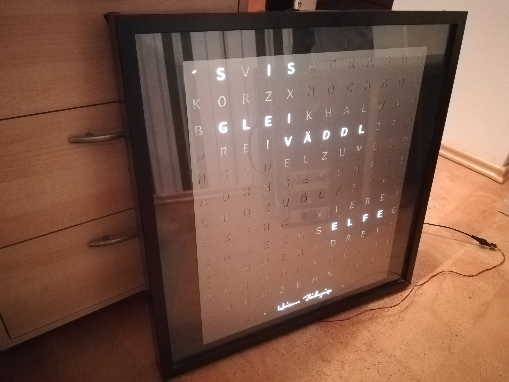
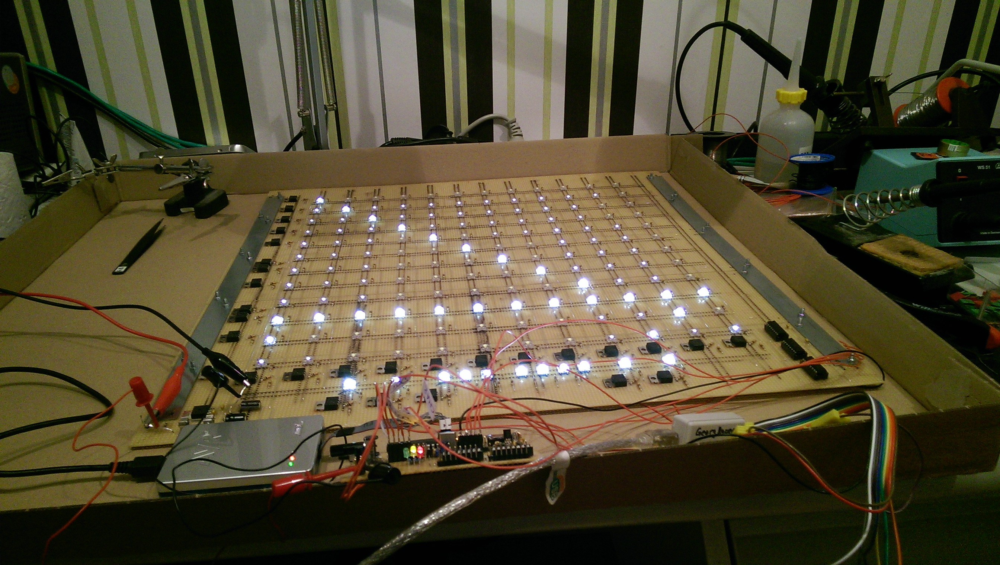
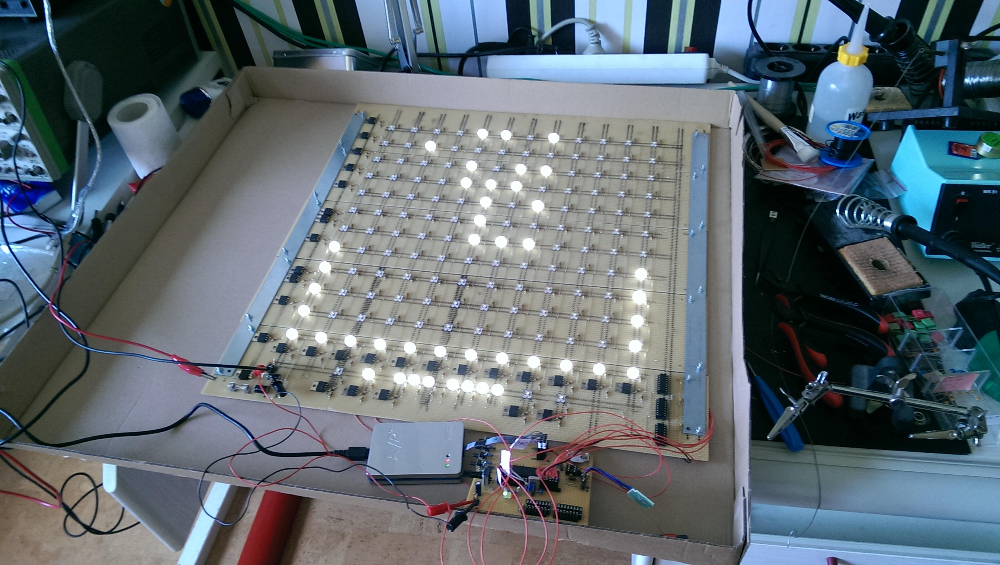
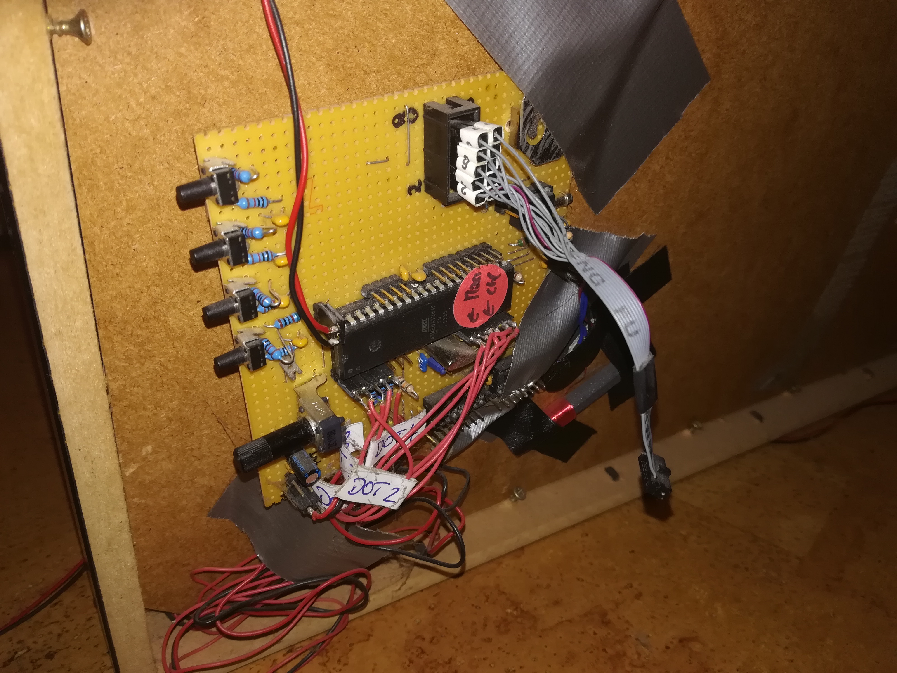

# clock-wise or Heisema Zeidozeiga
The Heisema Zeidozeiga displays the time in the wording of dialect Heisemarisch (Leutershausen an der Bergstraße near Heidelberg). It has special functions such as automatic brightness adjustment or automatic reception of the time by decoding the long-wave DCF-77 signal from Mainfingen near Frankfurt.

A project with a AtMega1284P programmed in C displays the local time with a 12x12 led matrix. For details see german documentation [file](Docu/Zeidozeiga_Dokumentation_003.docx).

This is a present for my dad's 60th birthday.

**Schematic**

[Eagle Schematic](Schematic/ClockWiseScematic.sch.pdf)

**Bill of materials**

[BOM](BOM/20140511_BillOfMaterials_Entwicklungskosten.pdf)

**Development**

